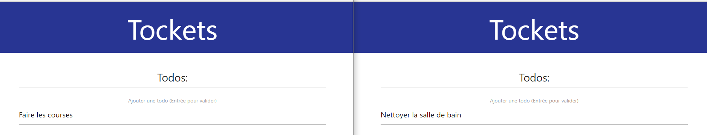
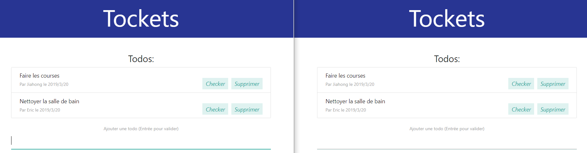
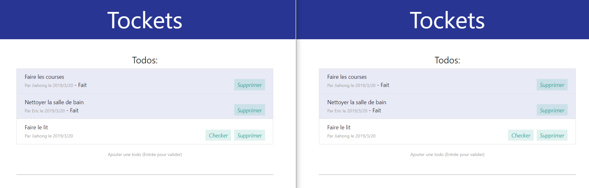
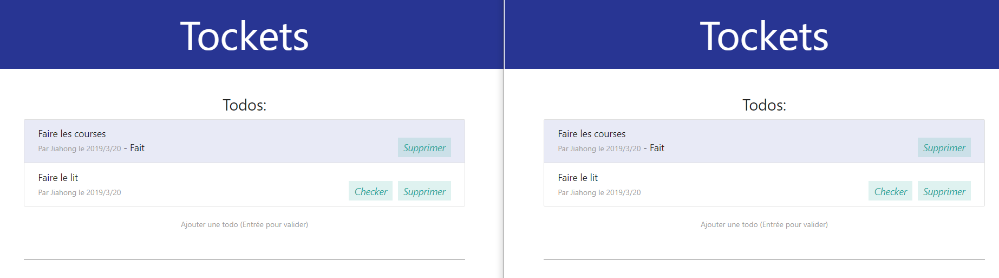

## A simple real-time online co-editing task list based on Node.js/Socket.io

### Login with a nickname

### Adding a task for different users

### After adding, tasks are specified by user name and date

### Check the tasks

### Deleting a task

